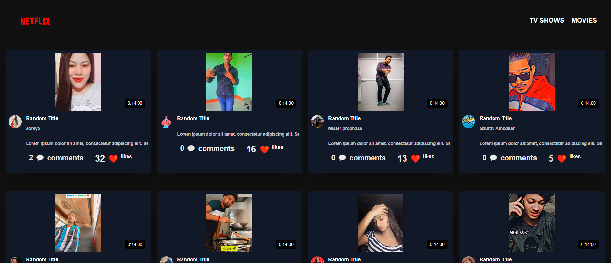

# Video Player App



Welcome to the official repository of your Video Player App. This React application provides a seamless video playback experience, enhanced with Tailwind CSS for styling and JavaScript for interactivity.

## Features

- **Video Playback:** Enjoy smooth video playback with essential controls for play, pause, volume, and seek.
- **Responsive Design:** The application is designed to be responsive, ensuring a consistent experience across various devices.
- **Tailwind CSS Styling:** Stylish and modern UI using Tailwind CSS for a clean and visually appealing interface.

## Tech Stack

This project is built using the following technologies:

- **React**: A JavaScript library for building user interfaces.
- **Tailwind CSS**: A utility-first CSS framework for styling components.
- **JavaScript**: The primary programming language for enhancing interactivity.
- **HTML5**: Used for structuring the application.
- **WebVTT (Web Video Text Tracks)**: Provides captions or subtitles for video content.

## Usage

To start the development server and run the application, follow these steps:

1. Install dependencies:

   ```bash
   npm install
